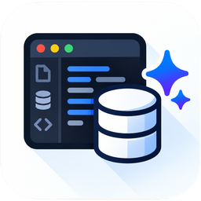

<p align="center"></p>

<h1 align="center">QueryMoat</h1>

<p align="center"><b>Give your AI agent safe access to your database.</b><br>
A read-only-by-default MCP server and a fast database client, inside VS Code, Cursor and Windsurf.</p>

**Formerly QueryDock.** Same extension, new name. Your `.querydockrc` files and AI client configs keep working; see [Moving from QueryDock](#moving-from-querydock).

This repository is QueryMoat's public home for **bug reports, feature requests and documentation**. The extension's source code is not public.

## Install

- **VS Code:** [Visual Studio Marketplace](https://marketplace.visualstudio.com/items?itemName=querymoat.querymoat), or search "QueryMoat" in the Extensions view.
- **Cursor, Windsurf, VSCodium:** [Open VSX](https://open-vsx.org/extension/querymoat/querymoat), or search "QueryMoat" in the Extensions view.

## What it does

- 🛡️ **Safe MCP server for AI agents.** Claude Code, Cursor, Windsurf and Copilot can read your schema and data through a local MCP server that is read-only by default and never writes to production.
- ⚡ **Zero config.** Finds databases in `.env`, `docker-compose.yml`, Laravel, Rails, Django, Supabase and Prisma projects.
- 🗂️ **Database client in your editor.** Browse, edit and export data, run SQL with `EXPLAIN` and history, and inspect schemas, keys and indexes.
- 🏠 **100% local.** No cloud proxy and no telemetry.

Supports **SQLite, PostgreSQL, MySQL, MariaDB and Microsoft SQL Server**.

## Moving from QueryDock

Install QueryMoat, then uninstall QueryDock (the last QueryDock release offers to do both). QueryMoat still reads `.querydockrc`, keeps an existing `~/.querydock/mcp-server.js` working for your AI client, and applies protected tags from `querydock.readOnlyEnvironments`. Other `querydock.*` settings and write permissions start fresh at their safe defaults. Details in the [extension README](https://marketplace.visualstudio.com/items?itemName=querymoat.querymoat).

## CI check

`querymoat-check` fails the build when your QueryMoat config could let an AI agent or a teammate write to a remote or production database, or leaks a password. Warn-only is opt-in.

```yaml
- uses: actions/checkout@v4
- uses: heysidhant/querymoat@v0.3.0
```

Any other CI: `npx querymoat-check [dir] [--warn-only] [--format text|github]` (exit `1` on errors).

| Rule | Level | Catches |
| :--- | :--- | :--- |
| `plaintext-password` | error | A password written into the file instead of `${env:VAR}` or `credentialKey` |
| `remote-missing-environment` | error | A connection to a non-local host (or a `${env:...}` host) with no `environment` tag |
| `remote-writable` | error | `"isReadOnly": false` on a remote host |
| `production-writable` | error | `"isReadOnly": false` on a connection tagged or named as production |
| `invalid-json` | error | A config file QueryMoat would silently ignore |
| `unknown-environment` | warning | A tag like `prd` that gets no protection |
| `sandbox-without-allowlist` | warning | `execPolicy: "sandbox"` with no `execAllowlist` |
| `workspace-disables-readonly` | warning | `querymoat.mcp.readOnly: false` in `.vscode/settings.json` |

## Documentation

- [Configuration (`.querymoatrc`)](docs/configuration.md)
- [MCP server for AI agents](docs/mcp.md)
- [Security model](docs/security.md)
- [Supported databases](docs/supported-databases.md)

## Get help

- 🐛 **Found a bug?** [Report it](https://github.com/heysidhant/querymoat/issues/new?template=bug_report.yml)
- 💡 **Want a feature?** [Request it](https://github.com/heysidhant/querymoat/issues/new?template=feature_request.yml)
- ⭐ **Want Pro early?** [Join the waitlist](https://github.com/heysidhant/querymoat/issues/1)

## License

QueryMoat is free to use, including at work, under the [QueryMoat End User License Agreement](LICENSE). The `querymoat-check` CLI is MIT-licensed.
